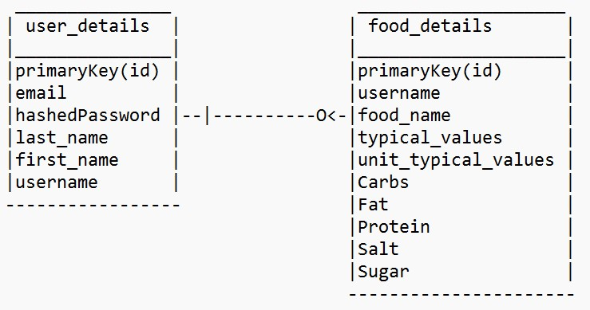

# myapp
Recipe Buddy
developer name - Rishi sankhla
student number - 33724434

In this project I have created a web application where user can track the different nutrition level for his/her meal.
They can perform following features:
 
R1 Home page: 
This page contain the links for all the pages like About page, add food page, search food page, update food page, list page, login, Register with us, log out.
file for this page is home.ejs, which is also the default page for our app. and the logic for this page is straight forward, we all the links passing to href from user can direct to the respected pages. 

R2 About page:
This page contains the information about our website, like the purpose of our web application and developer name and student number, with the button to direct back to home page.
file for this page is about.ejs.

R3 Register page:
This page contains a form to register new user, it collects all the necessary details like username, password, email, first name and last name.
file for this page register.ejs. logic for this page is quite straight forward, i.e. one get request to load the page and one post request to send the form data to insert user_details table. we can find the logic written in main.js file line number 101 & 174.
 
R4 Login:
This page just contain two input feild, i.e. username and password. through this page user can start his own unique session and can access other pages. Toimplement to logic of this page I have written one get request to load the page and one post request for the form, in the post request we check the username and hashedpassword in our mysql database, then provide the access accordingly.
file for this page is login.ejs, and the logic code dould be found in main.js file line number 105 and 122.

R5 Logout:
Link for this button is given on home page, through this user can sign out of the application. logic for this link could be found in main.js file line number 111. 

R6 Add food page:
This page contains the form to add food items, which had input feild for name, type value, unit for type value, carbs, fat, protein, salt and sugar (apart from that we also add the current user username in our mysql database). To build the logic for this page I have written one get request to load the page and one post request for the form to insert value in the food_details table.
file for this is addfood.ejs and the logic can be found in main.js line number 36 and 221.

R7 search page:
This page just contains one input feild for user to search through our database. To implement the logic for this page I have written one get request to load the page and post request for the form. But the trick here is, post not only search for the data but also send data back to the search page through ejs template.
file for this page is search.ejs, and logic for this page can be found in main.js file line number 30 and 57.
In our search page user can also search for multiple items with the same keyword name, for example, when searching for ‘bread’ display data related to ‘pitta bread’, ‘white bread’, ‘wholemeal bread’, and so on.

R8 Update food page:
logic for this part of the application is consists of two files, i.e. update.ejs and newupdate.ejs. In this first user search for the item, which he/she need to update, then he'll specify the primary key for a particular item, and then we will lod the new page where update form is given for that particular item.
On the update.ejs page we have two forms and one table to show extracted data, and in the newupdate.ejs page we have two forms to update or delete that item.
we can find the logic for this part of the application in main.js file line number 33, 80, 251, 283.
 
R8C Delete food page:
logic for this page is written in newupdate.ejs file, where user will first select a particular item on update.ejs then he will be directed to newupdate.ejs to delete that item. And once directed to the new page he/she can't change the index number.
To delete an item we are processing a post request in main.js line number 310.

Going beyond R8B and R8C:
To implement the Going beyond point here I have written one if statement in post request of update.ejs page, where we check whether the username of current selected item matches with the session id or not, if not then it won't even load the newupdate.ejs page (through user can update or delete that item).
we can find this if statement in the main.js file line number 299.

R9 List page:
This page contains one table to show all the extracted data from mysql and one form inside the table row header for the check box and the input feild, I was able to implement its logic with the help of one get request (to load the list page by passing data through ejs template) and one post request (to send collected data, so that we can calculate the total nutrients).
file for this page is list.ejs, and the logic can be found in main.js file line number 18 & 331.

R9C Going beyond:
To implement Going beyond point, first I have added one form in list.ejs file (which contains check box and input feild for each row), through which user can select check box and can write the multiplayer value for the respected row, then through the post request we accumulate all the selected row nutrients and multiply it with the input value, and in the end we send the data through res.send().
Reffer list.ejs file, and Logic for this part of the application can be found in main.js file line number 331.

R10 API	:
To access the api all we have to do is to write /api in our application url and it will show all the rows of food_details. To implement the logic for api I have written one get request which runs the select * query to extract all the data then send it as jason format.
reffer main.js file line number 41.  

R11 form-validation:
I have done form validation and sanitization on all the pages, where ever necessary. I have used many different types of validation commands like .isAlpha('en-US', {ignore: '\s'}, .isNumeric(), .notEmpty() etc. And if user inputs any wrong value then it either reloads the page or redirects back to the home page.
reffer main.js file line number 57,80,122,174,221,251,283,310.  

Access control:
To perform access control we are creating temporary session for the user, according to his username, then giving access to different pages respectively. for example only loggedin user can access update and addfood page.
reffer main.js file line number 33 & 36 (I have written redirectLogin keyword in both the get requests).

ER diagram:
For the database I have used mysql, in which I have created two tables naming user_details (which contains 6 columns) and food_details (which contains 10 columns). And both the tables have there own primary key.

It shares one to many relation, as each user from user_details table can add different food items in the food_details table.

